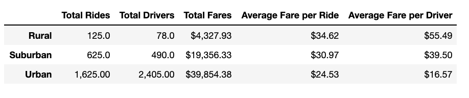
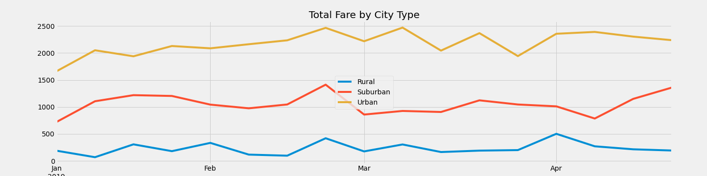

# PyBer Overview

The purpose of this project was to analyze PyBer, a ride share app, data to facilitate decision making. The analysis combines two data sets to produce summary table and a line chart. The Summary table allows the user to quickly see total and averages for Rides, Drivers, and Fares broken down by city type. The line chart was created by first creating a pivot table to organize fare by city type and week. The resulting line graph shows the change in fare over time for each city type. 

#Results

## PyBer Summary 

### Observations
* The number of Total Rides , Total Drivers, and Total Fares in rural cities is the lowest of all the city types
* The Average Fare per Ride and Average Fare per Driver in rural cities is the highest of any of the city types
* There is a significant increase in Total Rides, Total Drivers, and Total Fares from Rural cities to Suburban Cities
* The Suburban city Average Fare per Ride and Average Fare per Driver are lower than Rural and higher than Urban city types
* There is only a $4 difference between Rural and Suburban Average Fare per Ride
* Total Rides, Total Drivers, and Total Fares is the highest in Urban cities 
* There is a significant increase form Suburban to Urban the Total Rides , Total Drivers, and Total Fares. 
* Average Fare per Ride and Average Fare Per Driver is the lowest in urban cities
* Average Fare Per Driver for Urban cities is less than half of Average Fare Per Driver for Suburban Cities
## Total Fare by City Type 

### Observations
* There is an increase in fare for all city types in the fourth week in February 
* We do not see a consistent increase in fare over time for any of the city types
* the difference in fare between Urban and Suburban is greater than the difference between Suburban and Rural 
* there does not appear to be a strong relationship between any of the city types, they appear to increase and decrease independently. 

#Summary 

I recommend the following
1. Further analysis on the difference between Average Fare per Driver between Suburban and Urban cities to determine if Urban drivers are being paid adequately. 

2. Further analysis in rider habits to see why there was an increase in fare at the end of February. What advertising campaign ran at this time? If so, Can we recreate them? Are these new riders or did more current riders choose to ride share during this time? 

3. Targeted Add campaigns to increase the number of Suburban riders to narrow the gap between Suburban and Urban Riders. 
